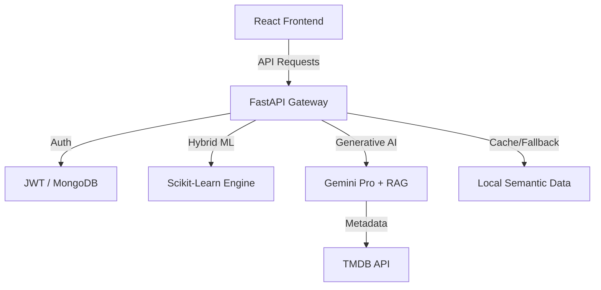

# 🎬 MovieMind AI — The Intelligent Movie Discovery Ecosystem


**MovieMind AI** is a state-of-the-art, full-stack movie recommendation platform that bridges the gap between traditional Machine Learning and modern Generative AI. It delivers hyper-personalized film suggestions through a sophisticated hybrid engine, featuring a premium glassmorphism UI and a multilingual AI assistant.

---

## 🚀 The Innovation: Why MovieMind?

Unlike standard recommendation engines, MovieMind AI employs a **multi-layered intelligence strategy**:
1.  **Hybrid Filtering**: Synergizing Content-Based (TF-IDF) and Collaborative Filtering (SVD) for data-driven accuracy.
2.  **Generative AI (Gemini Pro)**: Powering an intelligent chatbot that understands context, mood, and multilingual queries.
3.  **RAG (Retrieval-Augmented Generation)**: Enhancing AI responses with real-time metadata (cast, plot, reviews) from the TMDB API.
4.  **Resilience**: A custom **Circuit Breaker** mechanism that gracefully pivots to semantic search data when AI quotas are reached.

---

## ✨ Core Features

### 🧠 Advanced AI & ML
- **Hybrid Recommendation Engine**: Delivers "Picked for You" suggestions by analyzing genres, keywords, and global user rating patterns.
- **NLP Semantic Search**: Discover movies by describing a vibe (e.g., *"Dark psychological thrillers with a plot twist"*).
- **Context-Aware Chatbot**: A multilingual assistant (English, Hindi, Marathi) powered by Gemini and RAG for deep film trivia and suggestions.

### 🌗 Premium UI/UX
- **Glassmorphism Design**: A sleek, Netflix-inspired dark mode built with Vanilla CSS for high performance.
- **Interactive Animations**: Smooth transitions and micro-animations powered by **Framer Motion**.
- **Responsive Architecture**: Fully optimized for Desktop, Tablet, and Mobile experiences.

### 🔐 Robust Infrastructure
- **Secure Authentication**: JWT-based security with encrypted password hashing and Google OAuth integration.
- **Real-time Sync**: Live integration with **TMDB API** for up-to-the-minute movie metadata, trailers, and posters.
- **Personalized Space**: Users can manage a dynamic Watchlist and track their rating history.

---

## 🛠️ Technical Architecture

### **The Stack**
- **Frontend**: React 18, Vite, Framer Motion, Lucide Icons, Vanilla CSS.
- **Backend**: FastAPI (Asynchronous Python), Uvicorn.
- **Database**: MongoDB Atlas (NoSQL) for scalable user data and interaction storage.
- **AI/ML**: Google Gemini Pro, Scikit-learn, Pandas, NLTK.
- **DevOps**: Docker ready, Render/Vercel deployment configurations.

---

## 📊 System Design



---

## ⚙️ Installation & Setup

### 1. Prerequisites
- Python 3.10+
- Node.js 18+
- MongoDB Atlas Account
- TMDB API Key & Gemini API Key

### 2. Backend Setup
```bash
cd backend
python -m venv venv
source venv/bin/activate  # venv\Scripts\activate on Windows
pip install -r requirements.txt
uvicorn app.main:app --reload
```

### 3. Frontend Setup
```bash
cd frontend
npm install
npm run dev
```

---

## 🤝 Contributing

We welcome contributions to make MovieMind AI even smarter!
1. Fork the Project.
2. Create your Feature Branch (`git checkout -b feature/AmazingFeature`).
3. Commit your Changes (`git commit -m 'Add some AmazingFeature'`).
4. Push to the Branch (`git push origin feature/AmazingFeature`).
5. Open a Pull Request.

---

## 📄 License

Distributed under the MIT License. See `LICENSE` for more information.

---

### 👨‍💻 Developed By
**Omkar Ingle**
[](https://github.com/rajingle532)
[](https://linkedin.com/in/omkar1535)

*Built with ❤️ for the Cinematic Community*
